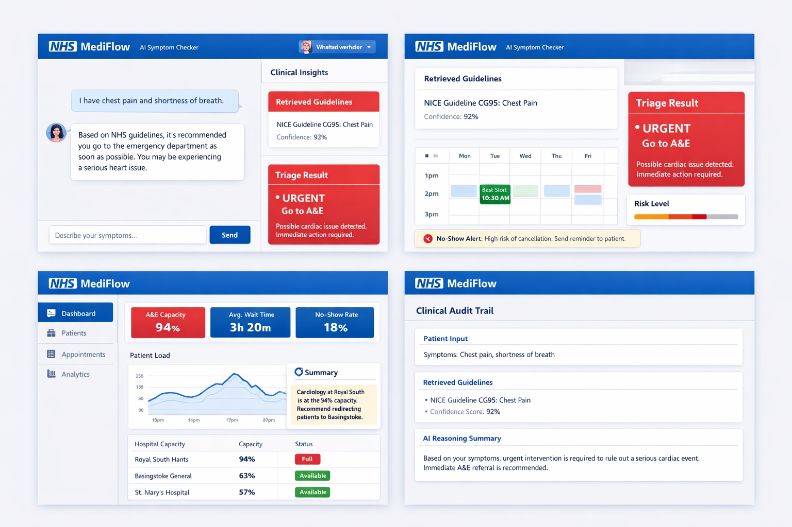

# 🏥 MediFlow AI

### Intelligent NHS Triage & Healthcare Optimization Platform

## 📌 Overview

**MediFlow AI** is an AI-powered healthcare platform designed to reduce pressure on the NHS by combining:

* 🧠 Large Language Models (LLMs)
* 🔍 Retrieval-Augmented Generation (RAG)
* 🧬 Vector Databases
* 📊 Real-time hospital analytics

The system provides **automated patient triage**, **smart appointment scheduling**, and **capacity optimization across hospitals**, helping reduce waiting times and improve patient outcomes.

## 🎯 Problem Statement

Healthcare systems face:

* Long waiting times
* Overcrowded emergency departments
* Staff shortages
* High no-show appointment rates

## 💡 Solution

MediFlow AI addresses these challenges through:

* 🤖 AI Symptom Checker
* 📚 RAG-based clinical reasoning
* 📅 Smart scheduling
* ⚠️ No-show prediction
* 🏥 Hospital load balancing
* 📊 Explainable AI audit trail


## 🖥️ Dashboard Features

* AI Chat Interface
* Triage Results Panel
* Appointment Scheduler
* Hospital Capacity Dashboard
* Patient Load Analytics
* Clinical Audit Trail



## 🏗️ Project Structure

```bash
mediflow-ai/
│
├── frontend/                 # React / Next.js app
│   ├── components/
│   ├── pages/
│   ├── services/             # API calls
│   └── styles/
│
├── backend/
│   ├── app/
│   │   ├── main.py           # FastAPI entrypoint
│   │   ├── routes/
│   │   │   ├── triage.py
│   │   │   ├── scheduling.py
│   │   │   └── analytics.py
│   │   │
│   │   ├── services/
│   │   │   ├── rag_pipeline.py
│   │   │   ├── embeddings.py
│   │   │   ├── vector_db.py
│   │   │   └── llm_service.py
│   │   │
│   │   ├── models/
│   │   │   ├── patient.py
│   │   │   ├── appointment.py
│   │   │   └── hospital.py
│   │   │
│   │   └── utils/
│   │       └── chunking.py
│   │
│   ├── data/
│   │   └── nhs_guidelines/   # PDFs or text files
│   │
│   └── requirements.txt
│
├── scripts/
│   ├── ingest_data.py        # Load + embed guidelines
│
├── README.md
└── .env
```


## 🏗️ System Architecture

### Frontend

* React / Next.js
* Tailwind CSS

### Backend

* FastAPI (Python)

### AI Layer

* LLM (GPT / Oracle Generative AI)
* Embedding model

### Data Layer

* Vector Database (Oracle Database 23ai / Pinecone)
* Structured data storage


## 🔄 RAG Pipeline

1. Data ingestion (NHS guidelines)
2. Chunking text
3. Generating embeddings
4. Storing in vector database
5. Retrieving relevant context
6. LLM generates response

## 🚀 Example Flow

1. User enters symptoms:

   > "Chest pain and shortness of breath"

2. System:

   * Retrieves relevant medical guidelines
   * Runs LLM analysis

3. Output:

   * 🚨 **URGENT: Go to A&E**
   * Explanation based on retrieved data

4. Dashboard:

   * Displays hospital capacity
   * Suggests alternative locations

5. Audit Trail:

   * Shows reasoning and source guidelines


## 🛠️ Tech Stack

| Layer    | Technology                     |
| -------- | ------------------------------ |
| Frontend | React, Tailwind                |
| Backend  | FastAPI                        |
| AI       | LLM (GPT / Oracle AI)          |
| RAG      | LangChain / LlamaIndex         |
| Database | Oracle DB 23ai (Vector Search) |
| Cache    | Redis (optional)               |

## 🗺️ Roadmap

* MVP chatbot
* RAG integration
* Triage classification
* Scheduling engine
* Optimization layer
* Final demo polish


## 🏆 Key Highlights

* Uses **RAG + Vector DB**
* Real-world healthcare impact
* Explainable AI (audit trail)
* Scalable architecture
* Strong UI dashboard


## 📢 Conclusion

MediFlow AI demonstrates how AI-powered systems can:

* Reduce healthcare system overload
* Improve patient outcomes
* Enable smarter resource allocation

---


