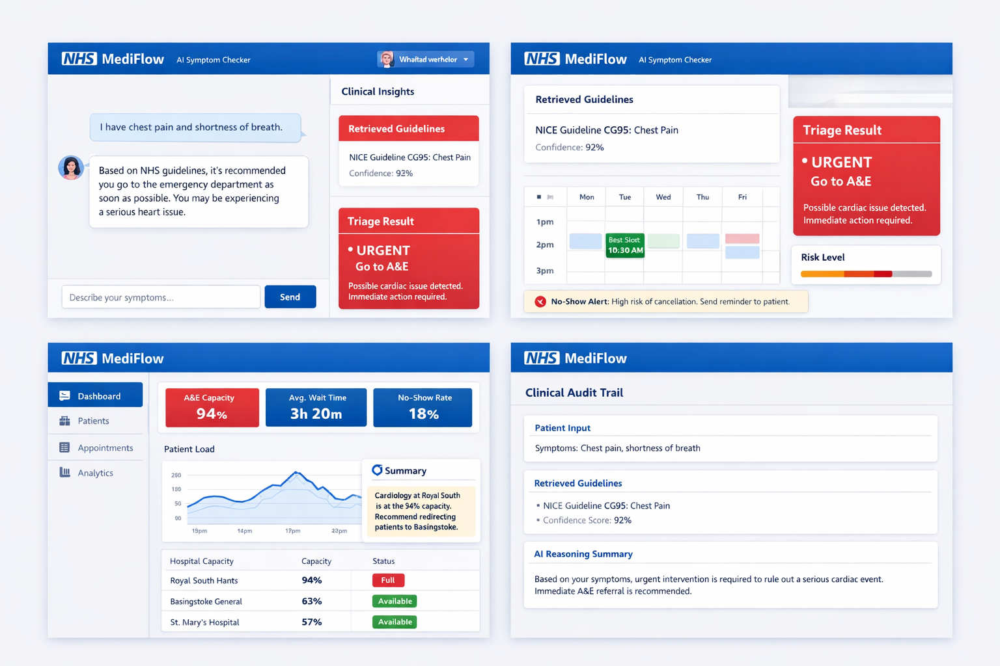

# 🏥 MediFlow AI

### Intelligent NHS Triage & Healthcare Optimization Platform

## 📌 Overview

**MediFlow AI** is an AI-powered healthcare platform designed to reduce pressure on the NHS by combining:

* 🧠 Large Language Models (LLMs)
* 🔍 Retrieval-Augmented Generation (RAG)
* 🧬 Vector Databases
* 📊 Real-time hospital analytics

The system provides **automated patient triage**, **smart appointment scheduling**, and **capacity optimization across hospitals**, helping reduce waiting times and improve patient outcomes.

## 🎯 Problem Statement

Healthcare systems face:

* Long waiting times
* Overcrowded emergency departments
* Staff shortages
* High no-show appointment rates

## 💡 Solution

MediFlow AI addresses these challenges through:

* 🤖 AI Symptom Checker
* 📚 RAG-based clinical reasoning
* 📅 Smart scheduling
* ⚠️ No-show prediction
* 🏥 Hospital load balancing
* 📊 Explainable AI audit trail


## 🖥️ Dashboard Features

* AI Chat Interface
* Triage Results Panel
* Appointment Scheduler
* Hospital Capacity Dashboard
* Patient Load Analytics
* Clinical Audit Trail



## 🏗️ Project Structure

```bash
MediFlow/
│
├── app.py                    # Streamlit entrypoint
├── frontend/
│   └── pages/                # Streamlit multi-page app
│       ├── Patients.py       # AI Symptom Checker
│       ├── Appointments.py   # Scheduling
│       ├── Dashboard.py      # Hospital capacity dashboard
│       └── Analytics.py      # Clinical audit trail + analytics
│
├── backend/
│   ├── app/
│   │   ├── main.py           # FastAPI entrypoint
│   │   ├── db.py             # SQLAlchemy engine/session (PostgreSQL)
│   │   ├── routes/
│   │   │   ├── triage.py
│   │   │   ├── chat.py
│   │   │   ├── scheduling.py
│   │   │   └── analytics.py
│   │   │
│   │   ├── services/
│   │   │   ├── rag_pipeline.py
│   │   │   ├── embeddings.py
│   │   │   ├── vector_db.py
│   │   │   └── llm_service.py
│   │   │
│   │   ├── models/           # SQLAlchemy ORM models (PostgreSQL)
│   │   │   ├── patient.py
│   │   │   ├── appointment.py
│   │   │   ├── hospital.py
│   │   │   └── triage_session.py
│   │   │
│   │   └── utils/
│   │       ├── chunking.py
│   │       └── triage_logging.py
│   │
│   ├── scripts/
│   │   ├── ingest_data.py    # Load + embed NHS guidelines
│   │   └── seed_db.py        # Seed sample hospitals/patients/appointments
│   │
│   ├── data/
│   │   └── nhs_guidelines/   # Guideline PDFs (git-ignored)
│   │
│   ├── chroma_db/            # Local persistent vector store (git-ignored)
│   └── requirements.txt
│
├── README.md
├── .env.example
└── .gitignore
```


## 🏗️ System Architecture

### Frontend

* Streamlit (multi-page app)

### Backend

* FastAPI (Python)

### AI Layer

* LLM: Groq (`llama-3.1-8b-instant`)
* Embedding model: `sentence-transformers` (`all-MiniLM-L6-v2`)
* Custom-built RAG pipeline (no LangChain/LlamaIndex)

### Data Layer

* Vector store: ChromaDB (local, persistent)
* Structured data: PostgreSQL via SQLAlchemy (patients, appointments, hospitals, triage session log)


## 🔄 RAG Pipeline

1. Data ingestion (NHS guidelines)
2. Chunking text
3. Generating embeddings
4. Storing in vector database
5. Retrieving relevant context
6. LLM generates response

## 🚀 Example Flow

1. User enters symptoms:

   > "Chest pain and shortness of breath"

2. System:

   * Retrieves relevant medical guidelines
   * Runs LLM analysis

3. Output:

   * 🚨 **URGENT: Go to A&E**
   * Explanation based on retrieved data

4. Dashboard:

   * Displays hospital capacity
   * Suggests alternative locations

5. Audit Trail:

   * Shows reasoning and source guidelines


## 🛠️ Tech Stack

| Layer      | Technology                                  |
| ---------- | -------------------------------------------- |
| Frontend   | Streamlit                                    |
| Backend    | FastAPI                                      |
| LLM        | Groq (`llama-3.1-8b-instant`)                |
| Embeddings | `sentence-transformers` (`all-MiniLM-L6-v2`) |
| RAG        | Custom pipeline (chunking + retrieval, no LangChain/LlamaIndex) |
| Vector DB  | ChromaDB (local, persistent)                 |
| Database   | PostgreSQL (SQLAlchemy ORM)                  |

## 🗺️ Roadmap

* [x] MVP chatbot (symptom checker, streaming + non-streaming)
* [x] RAG integration (ChromaDB + sentence-transformers + Groq)
* [x] Triage classification (LOW / URGENT)
* [x] Scheduling engine (best-slot suggestion, no-show risk heuristic)
* [x] PostgreSQL-backed data layer (patients, appointments, hospitals, audit log)
* [x] Explainable audit trail (real logged sessions + retrieval confidence)
* [ ] No-show *outcome* tracking (currently predicts risk only, never checked against what actually happened)
* [ ] Real A&E patient-load feed (dashboard currently uses an illustrative curve)
* [ ] Final UI polish


## 🏆 Key Highlights

* Uses **RAG + Vector DB**
* Real-world healthcare impact
* Explainable AI (audit trail)
* Scalable architecture
* Strong UI dashboard


## 📢 Conclusion

MediFlow AI demonstrates how AI-powered systems can:

* Reduce healthcare system overload
* Improve patient outcomes
* Enable smarter resource allocation

---


